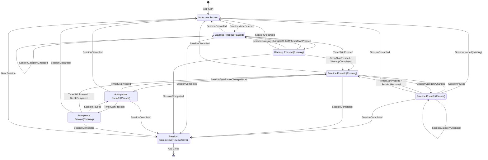

30 he# Session Life-cycle Reference

This document defines the complete session life-cycle flow and rules for the JazzX app. This serves as THE REFERENCE for all session-related state management and optimization work.

## Initial Setup (First Time User)

### Default User Preferences
- **Instrument**: Guitar
- **Warmup**:
  - Time: 20 minutes (1200 seconds)
  - Metronome: Enabled
  - BPM: 80
- **Auto Break**:
  - Enabled: true
  - Interval: 20 minutes (1200 seconds)
  - Duration: 5 minutes (300 seconds)

**NOTE**: All times in Firebase are stored in seconds. All timestamps are Unix timestamps (e.g., 1749621600).

## Session State Diagram



### State Transition Events Reference

| Event | Trigger Source | Description | From States | To State |
|-------|----------------|-------------|-------------|----------|
| `PracticeModeSelected` | Practice Mode Buttons | Start new session with selected category | SessionInitial | SessionActive_Warmup_Paused |
| `SessionLoaded` | App Startup | Resume existing/aborted session | SessionInitial | SessionActive_Practice_Paused |
| `TimerStartPressed` | Timer Start/Resume Button | Start or resume current phase | Any Paused State | Corresponding Running State |
| `SessionPaused` | Timer Pause Button | Pause current activity | Any Running State | Corresponding Paused State |
| `TimerSkipPressed` | Timer Skip Button | Skip current phase (warmup/break) | Warmup/Break States | SessionActive_Practice_Running |
| `SessionCategoryChanged` | Category Selection | Change practice category (always pauses) | Any Active State | Paused State |
| `SessionAutoPauseChanged(true)` | Auto-pause System | Trigger break after interval | SessionActive_Practice_Running | SessionActive_Break_Paused |
| `SessionCompleted` | Session Done Button | Complete and finalize session | Any Active State | SessionCompletedState |
| `SessionDiscarded` | Discard Button | Cancel and discard session | Any Active State | SessionInitial |

### Critical State Transition Rules

1. **Category Changes Always Pause**: Any category change forces a pause state to save current time
2. **Auto-pause Triggers Break**: Practice running automatically transitions to break paused
3. **Skip Events Advance Phases**: Skip warmup → Practice, Skip break → Practice
4. **Completion from Any State**: Session can be completed from any active state
5. **Discard Returns to Initial**: Any active state can be discarded back to initial
6. **Time Tracking on Transitions**: Pause events save accumulated time to current category

### Time Tracking Points

- **Pause Events**: Save accumulated time to current category using timestamps
- **Resume Events**: Set new start timestamp for time calculation
- **Category Changes**: Save time to old category before switching to new category
- **Completion**: Calculate final duration from all categories + warmup time
- **Critical Rule**: Use event timestamps for time calculations, NOT timer display values

## Session Life-cycle Flow

### App Startup - Session Recovery
**State**: NO SessionBloc state instantiated (not even SessionInitial)

**Draft Session Check**:
1. **Check user preferences** for existing 'draft' session
2. **If draft session found**:
   - Show dialog: "Continue with previous session or discard it?"
   - **Continue**: Load draft session → SessionActive state
   - **Discard**: Delete draft, proceed to clean startup
3. **If no draft session**: Proceed to clean startup

### App Startup (Clean - No Draft Session)
**Session Screen UI**:
- No practice mode button selected
- All practice timer buttons disabled
- Dummy practice detail card shows: "Select your practice to start"

**User Options**:
1. Select practice mode (e.g., 'Exercise') → Creates SessionInitial
2. Navigate elsewhere via menu (top left)
3. Manually add session via '+' button (top right) → Manual Entry Flow

### 1. Practice Mode Selection
**Trigger**: User clicks practice mode 'Exercise'

**State Change**:
```
NO STATE → SessionInitial
```

**Session Creation**:
```
sessionID = current timestamp (e.g., 1749621600)
Session object created with category data copied from last session
```

**Category Data Inheritance**:
- **Copy from**: Session with ID = `lastSessionId` (from user preferences)
- **Copy fields**: note, links, songs (but NOT time)
- **Reset fields**: time = 0 for all categories
- **Purpose**: Continue working on same songs/notes without time carryover

### 2. Session Start
**Trigger**: User clicks 'Start' on practice timer

**State Change**:
```
SessionInitial → SessionActive
```

**Important Rule**: Any practice mode change will PAUSE the session (even during warmup)

**Session Flow Branches**:
- If warmup enabled → Go to 1a) Warmup Phase
- If warmup disabled → Go to 1b) Main Practice Phase

### 1a) Warmup Phase
**Trigger**: Session started with warmup enabled

**Warmup Behavior**:
- Practice timer starts counting DOWN from warmup time (e.g., 20:00 → 19:59 → ...)
- Metronome automatically starts at configured BPM (80)

**Warmup Completion**:
Warmup ends when EITHER:
1. Warmup time fully elapsed (timer reaches 00:00)
2. User clicks 'Skip' button in practice timer widget

**Session.warmup Data**:
```
session.warmup = Warmup {
  time: actual_warmup_time_elapsed  // NOT the configured time, but actual time spent
  bpm: 80
  // Other fields...
}
```

**Important**: `session.warmup.time` contains the ACTUAL time elapsed during warmup (calculated from event timestamps: warmup_end_timestamp - session.started)

**After Warmup**: Continue to 1b) Main Practice Phase

### 1b) Main Practice Phase
**Trigger**:
- Warmup completed (if enabled), OR
- Session started with warmup disabled

**Practice Timer Behavior**:
- Timer starts counting UP from 0 (first time)
- OR from previously saved time for current practice category
- Auto-break watcher starts counting (if enabled)

**Auto-Pause Rules**:
- Auto-pause monitoring ONLY starts when practice begins (NOT during warmup)
- Auto-pause timer resets to full interval on every practice start/restart
- Auto-pause tracks active practice time within CURRENT category only (NOT cumulative across categories)
- Category switching triggers pause but does NOT reset auto-pause timer
- Resuming practice (after any pause) ALWAYS resets auto-pause timer to full interval
- Warmup time does NOT count toward auto-pause interval

**Available Practice Categories** (time-tracking categories):
- **Exercise** (selected in this example)
- **New Song**
- **Lesson**
- **Fun**

**Category Initialization Rules**:
- ALL categories created immediately when session starts (not when first used)
- Each category starts with `SessionCategory(time: 0)`
- Additional fields (note, bpm, songs, links) are null by default
- Categories can be switched even during warmup
- Category switching ALWAYS pauses the session

**Session PAUSE Triggers**:
1. User toggles start/pause button
2. User changes practice mode
3. User clicks "session done"
4. Auto-break INTERVAL elapsed (20 min)
   - Timer starts counting DOWN from auto-break duration (5 min)

**Important**: When session pauses, currently elapsed time is saved in current category.
**Critical Rule**: If pause is due to category change, save time in currentCategory BEFORE changing its value.

**CRITICAL TIMING RULE**: DO NOT use timer elapsed time for updating time in the session object. Use instead the event timestamp vs saved timestamps on state changes. Timer elapsed time is for display only and can have precision/synchronization issues.

**Session RESUME Triggers**:
1. User toggles start/pause button
2. Auto-break TIME elapsed (5 min break completed)

### Auto-Break System Details
**Auto-Break Watcher**:
- Runs in background during active practice
- Tracks cumulative active practice time
- Triggers break when interval reached (20 min)

**Auto-Break Flow**:
```
Active Practice (counting up)
→ (20 min active time elapsed) →
Session PAUSES automatically
→ Break Timer (counting down from 5 min)
→ (5 min break completed) →
Session RESUMES automatically
```

**State Changes**:
```
SessionActive { isOnBreak: false, isPaused: false }
→ (20 min active elapsed) →
SessionActive { isOnBreak: true, isPaused: true }
→ (5 min break elapsed) →
SessionActive { isOnBreak: false, isPaused: false }
```

### 5. Session Completion
**Triggers**:
- [TO BE DEFINED - user manually ends session?]
- [TO BE DEFINED - automatic completion conditions?]

**State Flow**:
```
SessionActive → SessionCompletedState
```

**Actions**:
- Calculate final session duration
- Save session to Firebase
- Update statistics
- Navigate to session review

## State Management Rules

### Timer Architecture
**Single Timer Widget**: Only ONE timer in practice timer widget handles all timing scenarios.

**Timer Modes**:

1. **Count DOWN Mode** (Warmup & Auto-Break):
   ```dart
   timer.startCountDown(
     initialTime: warmupTime, // e.g., 1200 seconds (20 min)
     onComplete: () => { /* warmup/break finished */ },
     onSkip: () => { /* user clicked skip */ }
   )
   ```

2. **Count UP Mode** (Main Practice):
   ```dart
   timer.startCountUp(
     initialValue: category[currentCategory].time ?? 0, // resume from saved time
     onSecondTick: () => { /* check auto-break interval */ }
   )
   ```

### Timer Callbacks
- **Count Down**: Callback on completion (0 reached) OR skip button
- **Count Up**: Callback every second to monitor auto-break interval

### Time Calculation Strategy
**Important**: Timestamps calculated using STATE CHANGE EVENT timestamps, NOT timer values.

```dart
// Example time calculation:
actual_warmup_time = warmup_end_event.timestamp - session.started
category_time = pause_event.timestamp - category_start_event.timestamp
```

**Rationale**: Timer is for DISPLAY only. Actual time tracking uses precise event timestamps.

---

## Questions to Clarify

1. **Warmup Phase**:
   - How exactly is warmup state detected?
   - What UI/UX changes during warmup?
   - Can user interact with practice categories during warmup?

2. **Practice Categories** - CLARIFIED:
   - **Available Categories**: Exercise, New Song, Repertoire, Lesson, Theory, Video, Gig, Fun (8 total)
   - **Time-Tracking Categories**: Exercise, New Song, Lesson, Fun (4 categories mentioned by user)
   - **Session Initialization**: ALL categories created with `time: 0` by default
   - **Category Creation**: Categories created when session starts, not when first used
   - **Default Category**: currentPracticeCategory (only starts upon selection)

3. **Auto-Break**:
   - What exactly happens during break state?
   - How does break time interact with session duration?

4. **Session Timing** - CLARIFIED:
   - **Session Duration**: `duration = sum(all category times) + warmup.time`
   - **Warmup time**: INCLUDED in total session duration
   - **Auto-break time**: NOT included in session duration (paused time)
   - **Calculation timing**: Performed when user clicks "session done"

5. **State Persistence** - CLARIFIED:
   - **Draft session**: Saved to user preferences during active session
   - **Final session**: Saved to Firebase when user chooses "Save" from summary screen
   - **Session recovery**: Draft session loaded on app startup if found
   - **Category inheritance**: New sessions copy category data (except time) from lastSessionId

---

## Manual Session Entry Flow ('+' Button)

### Manual Entry Process
**Trigger**: User clicks '+' button (top right of session screen)

**Flow**:
1. **Date/Time Picker**: User selects date and time for the session
2. **Navigation**: Direct to `SessionReviewScreen` with:
   ```dart
   SessionReviewScreen(
     sessionId: selectedDateTime.millisecondsSinceEpoch ~/ 1000,
     session: null,
     manualEntry: true,
     initialDateTime: selectedDateTime
   )
   ```
3. **Session Creation**: Creates default Session object in edit mode
4. **Manual Data Entry**: User manually enters:
   - Session duration
   - Practice categories (time, notes, songs, links)
   - Instrument selection
5. **Save**: Session saved directly to Firebase (bypasses SessionBloc entirely)

### Key Differences from Live Session
- **No SessionBloc involvement** - completely separate flow
- **No real-time tracking** - all data entered manually
- **Direct to review screen** - skips active session state
- **Immediate edit mode** - user can modify all fields
- **Past date/time allowed** - can enter historical sessions

### Manual Entry State Flow
```
NO STATE → AddManualSessionButton → Date/Time Picker → SessionReviewScreen (edit mode) → Save to Firebase
```

**Important**: Manual entry completely bypasses the SessionBloc state machine and live session tracking.

---

## ✅ IMPLEMENTED ENHANCEMENTS

### Priority 1 Features - COMPLETED

#### 1. Category Data Inheritance ✅
- **Enhanced Session.getDefault()** with lastSession parameter
- **Automatic copying** of note, links, songs, bpm from last session
- **Time reset** to 0 for new session
- **Seamless continuation** of practice content

#### 2. Save-Before-Change Rule ✅
- **SessionCategoryChanged** enhanced with currentElapsedSeconds
- **SessionPaused** enhanced with currentElapsedSeconds
- **Automatic time saving** before category switches
- **Timer integration** with SessionBloc events

#### 3. Auto-Save Draft ✅
- **SessionAutoSave** event for periodic saves
- **Framework ready** for UI-triggered auto-saves
- **Session state preservation** during active sessions

#### 4. Session Completion with Duration Calculation ✅
- **SessionCompleted** enhanced with currentElapsedSeconds
- **Automatic duration calculation**: sum(category times) + warmup time
- **End timestamp** setting
- **Complete session finalization**
- **Navigation to summary screen** implemented

### UI Integration - COMPLETED ✅

#### 1. Auto-Save Integration ✅
- **Periodic auto-save** every 30 seconds during active sessions
- **Draft session saving** to user preferences
- **Automatic session recovery** on app restart

#### 2. Practice Timer Integration ✅
- **Session Done button** triggers SessionCompleted with elapsed time
- **Pause/Resume buttons** trigger enhanced events with elapsed time
- **Category switching** passes elapsed time for save-before-change

#### 3. Session Flow Integration ✅
- **Automatic navigation** to SessionReviewScreen on completion
- **Complete session lifecycle** from start to summary screen

---

## Session Completion Flow - CLARIFIED

### Session End Trigger
**Trigger**: User clicks "session done" button

### State Transition
```
SessionActive → SessionCompletedState
```

### Session End Process
1. User clicks "session done"
2. Current category time is saved
3. **Session duration calculated**: `duration = sum(all category times) + warmup.time`
4. End timestamp set: `ended = current timestamp`
5. Session transitions to SessionCompletedState
6. **Navigation**: Redirect to Summary (Review) Screen

### Summary Screen Options
**User can**:
- **Save session**: Final save to Firebase, navigate back to session screen
- **Go back**: Return to SessionActive state, continue same session

---

*This document will be updated as we clarify the exact rules and implementation details.*
